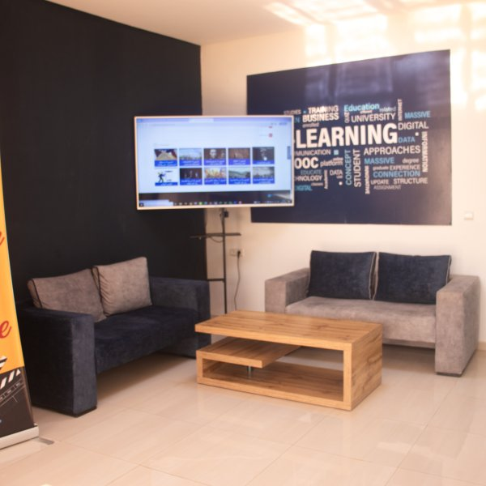

# 🎓 CIPN – Centre d'Innovation Pédagogique et Numérique

> Official website of the Centre d'Innovation Pédagogique et Numérique at Ibn Tofail University, Kénitra, Morocco.

🌐 **Live Demo** → [https://fatimaez-zahrae11.github.io/cipn-website/](https://fatimaez-zahrae11.github.io/cipn-website/)

---

## 📸 Preview



---

## 📋 About

This project is a showcase website developed for the **CIPN (Centre d'Innovation Pédagogique et Numérique)** at **Ibn Tofail University, Kénitra**. It presents the spaces, services and resources available to the university community to enrich the digital learning experience.

---

## ✨ Features

- 🧭 **Fixed navigation** with smooth scroll to sections
- 🎬 **Spaces presentation** : studios, production room, training room
- 🛠️ **Services** : video production, training, podcasts, streaming...
- 🖼️ **Photo gallery** with animated hover effect
- 📊 **Key figures** of the center
- 📬 **Contact form**
- 📱 **Fully responsive** (mobile, tablet, desktop)

---

## 🛠️ Built With

| Technology | Usage |
|---|---|
| HTML5 | Structure and semantics |
| CSS3 | Styling and animations |
| Flexbox | Element layout |
| CSS Grid | Gallery and card grids |
| Media Queries | Responsive design |

---

## 📁 Project Structure

```
cipn-website/
│
├── index.html            # Main page
├── style.css             # Stylesheet
├── logo.png              # CIPN logo
├── reception.png         # Reception photo
├── studio1.jpg           # Green Screen Studio
├── studio2.jpg           # Plateau Studio
├── studio3.jpg           # Pedagogical video studio
├── regie.jpg             # Production room
├── salle-formation.jpg   # Training room
└── README.md             # Documentation
```

---

## 🚀 Run Locally

```bash
# Clone the repository
git clone https://github.com/fatimaez-zahrae11/cipn-website.git

# Navigate to the folder
cd cipn-website

# Open in browser
start index.html   # Windows
open index.html    # Mac
```

---

## 👩‍💻 Author

**Fatima Ez-Zahrae**
Computer Engineering Student
ENSA , Kénitra

---

## 📄 License

This project was developed for **educational purposes** as part of a university exam.
